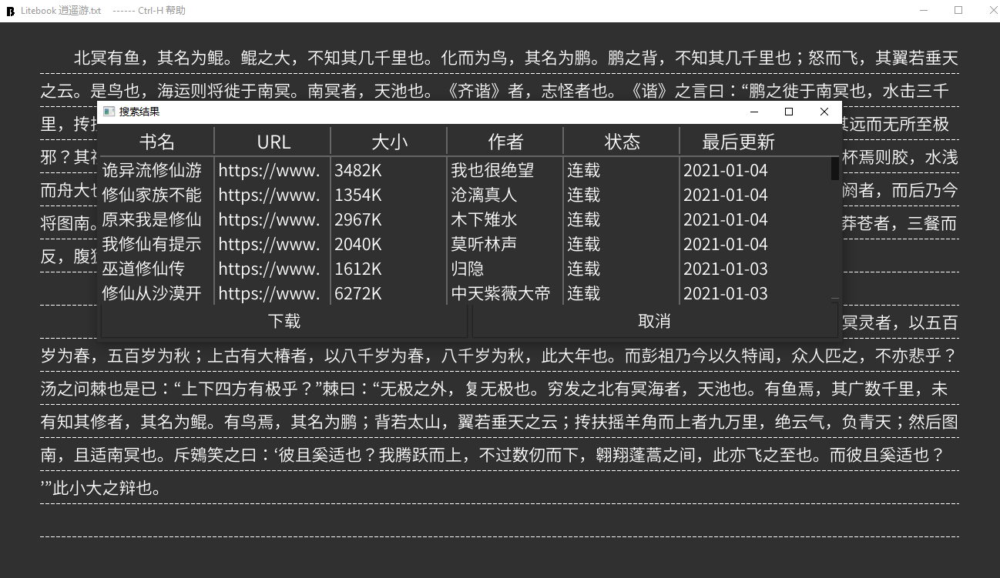

# 简介
golitebook 是一个看书软件， 关键功能如下：

* 支持Unicode
* 通过插件支持从网站搜索，下载并更新小说
* 简约设计，所有操作都可以通过快捷键实现
* 智能分段
* Dark Mode (only)

# 长这个样子

# 帮助
Contrl-H 显示简单帮助

## 阅读操作

* 滚行: Up, Down, J, K, 鼠标滚轮
* 翻页: PageUp, PageDown, Left, Right, Space
* 首页: Home
* 末页: End
* 放大缩小字体： =/-

## 功能快捷键

* 打开文件:Ctrl+O
* 网络搜索:Alt+C
* 订阅管理:Ctrl+Y
* 智能分段:Ctrl+Alt+F
* 显示帮助:Ctrl+H
* 章节列表:Ctrl+U
* 设置下划线:Ctrl+L
* 全屏显示:Ctrl+P
* 选择字体文件:Alt+Z
* 退出:Ctrl+W

# 显示
## 字体
golitebook内置并缺省使用[思源字体（Source Han Sans）](https://github.com/adobe-fonts/source-han-sans/tree/release/)；
但是用户也可以使用其他任意的TTF字体，Alt-Z进行选择
## 下划线
golitebook支持下划线模式：

* 没有下划线
* 实线
* 虚线

Ctrl+L 进行选择

## 智能分段

有时候小说文本的排版比较凌乱，比如说很多空行或是很多短句， 看起来很不舒服，智能分段将文本重新排版，删除空行，合并短句，使得阅读体验更好，Ctrl+Alt+F

# 插件系统

golitebook 通过插件系统实现小说搜索，下载和更新；插件是一个可执行文件，每一个插件对应一个网站；

插件可以用任何支持[gRPC](https://grpc.github.io/)的语言编写（如 python, Go等)，其本质就是一个实现了golitebook plugin API的gRPC sever，golitebook实现其gRPC client，通过API Call向插件的请求搜索、下载， 然后插件再向目标网站进行搜索下载操作，将结果返回给golitebook；具体的API文档参见[protobuf](api/api.proto)文件

`golitebook(client) ---> plugin X ----> 网站 X`

插件的gRPC server必须监听127.0.0.1

每个插件的可执行文件必须支持以下的命令行参数：
* `-p <1-65535>`: gPRC sever的端口号
* `-logf <filepath>`: log文件路径

## 插件的安装
将插件的可执行文件放在 %UserConfigDir/litebook/plugins目录下
%UserConfigDir 的值取决于操作系统（参见[文档](https://golang.org/pkg/os/#UserConfigDir))

简单来说，%UserConfigDir为：
Windows: %AppData%
Linux: $XDG_CONFIG_HOME（如其为空，则$HOME/.config)
OSX: $HOME/Library/Application Support

注：golitebook并不包括任何插件